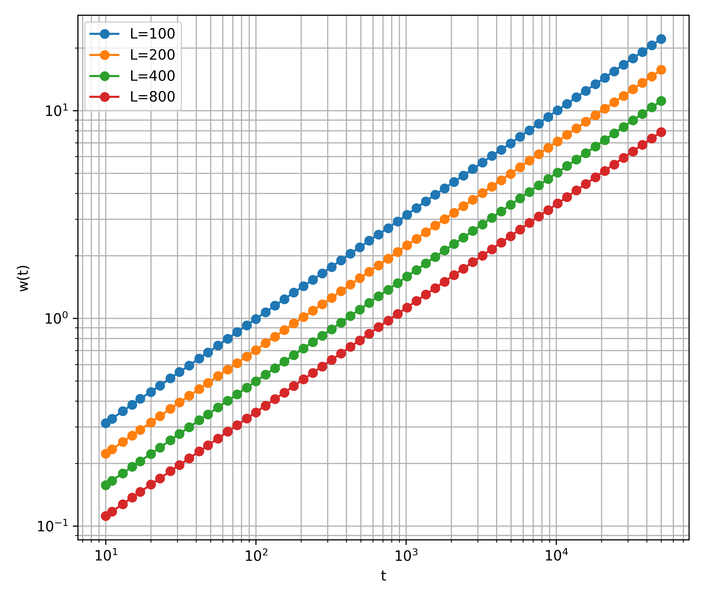
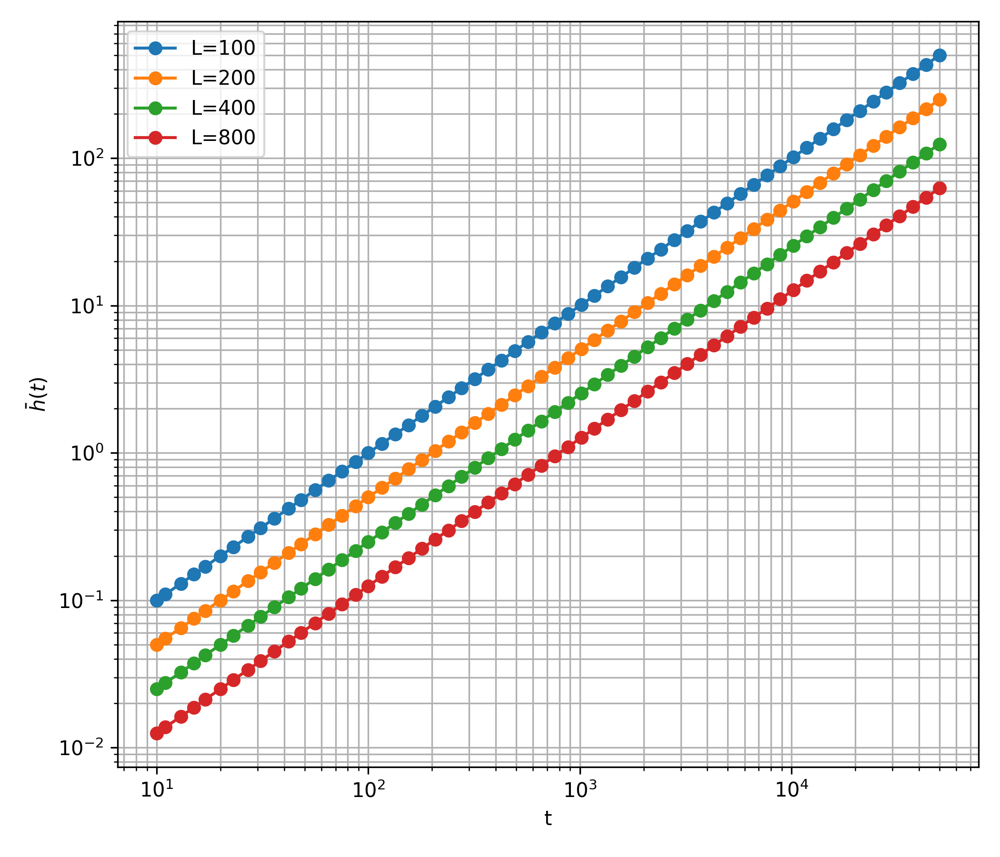
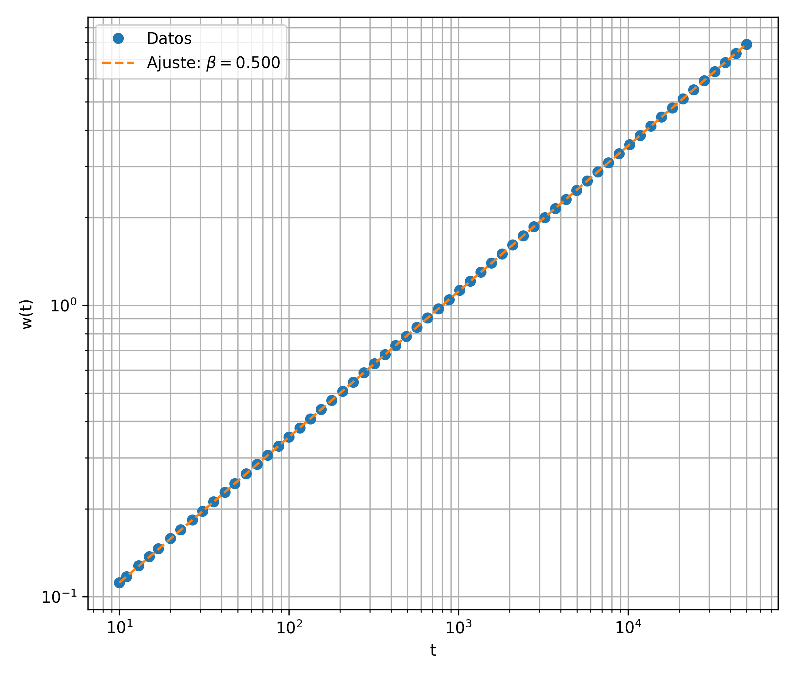
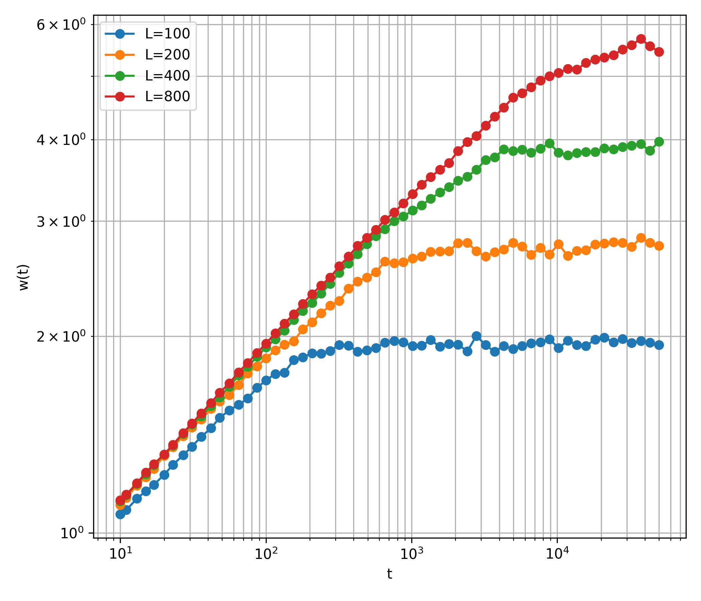
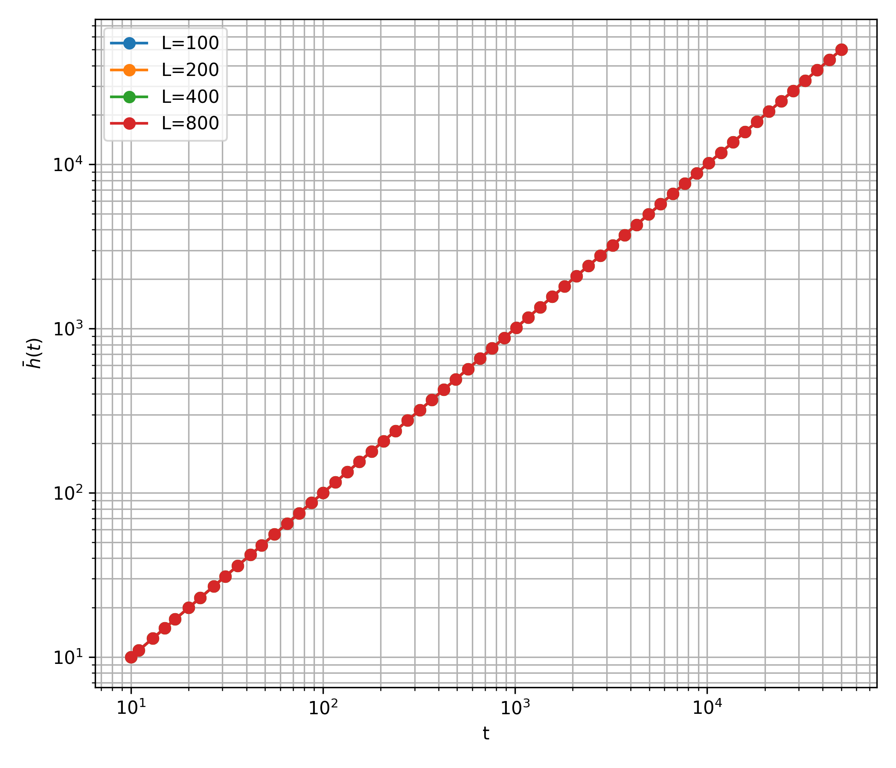
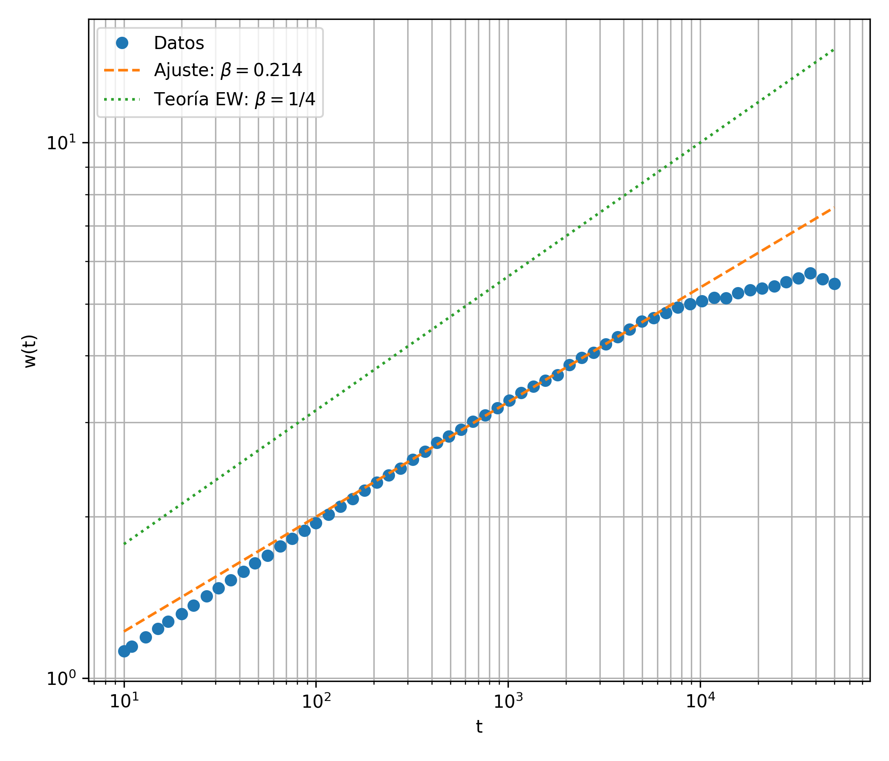
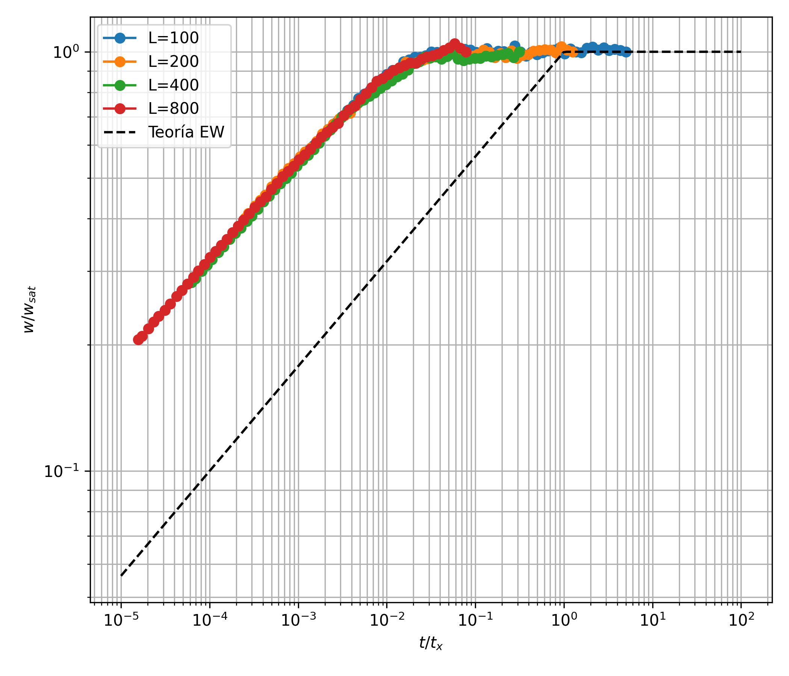

# Critical and Cooperative Phenomena — Simulations

Python implementations of three core non-equilibrium growth phenomena from the Critical Phenomena and Cooperative Phenomena course, demonstrating universality classes and scaling behavior in interface dynamics.

## Overview

This project simulates three fundamental models in non-equilibrium statistical physics:

1. **Random Deposition (RD)** — Pure deposition showing KPZ universality
2. **Random Deposition with Surface Relaxation (RDSR)** — Relaxation-dominated growth with Edwards-Wilkinson scaling
3. **Wetting Dynamics** — Critical behavior in thin film dynamics with power-law interactions

Each model exhibits characteristic scaling exponents and universality classes that capture essential physics of far-from-equilibrium systems.

## Repository Layout

```
├── simulations/
│   ├── random_deposition.py       # RD simulation: KPZ class (β ≈ 0.5)
│   ├── surface_relaxation.py      # RDSR simulation: EW class (β ≈ 0.25)
│   └── wetting.py                 # Wetting simulation: θ(p) exponent
├── scripts/
│   ├── run_rd.py                  # Execute RD with multiple sizes
│   ├── run_rdsr.py                # Execute RDSR with scaling collapse
│   └── run_wetting.py             # Execute wetting: scan interaction p
├── figures/                        # Output PNG figures
│   ├── varianzasRD.png
│   ├── mediasRD.png
│   ├── ajusteRD.png
│   ├── varianzasRDSR.png
│   ├── mediasRDSR.png
│   ├── ajusteRDSR.png
│   ├── colapsoRDSR.png
│   └── thetaEnFuncioDep.png
└── README.md
```

## Physical Models

### 1 — Random Deposition (RD)

Pure random deposition on a 1D substrate: particles are randomly deposited at each timestep without any interaction or relaxation.

**Scaling relation:**
$$w(t) \sim t^\beta, \quad \beta \approx 0.5 \text{ (KPZ class)}$$

**Roughness evolution:**

| Width vs Time | Mean Height | Power-Law Fit |
|---|---|---|
|  |  |  |

**Key features:**
- Continuous roughening over time
- Non-smooth (fractal-like) interfaces
- Width grows as $\sqrt{t}$ — slow roughening
- Belongs to **Kardar-Parisi-Zhang (KPZ)** universality class
- Models many physical systems: molecular beam epitaxy, erosion

---

### 2 — Random Deposition with Surface Relaxation (RDSR)

Combines random deposition with local surface relaxation: deposited particles preferentially occupy the lowest-energy site among themselves and their neighbors (energy minimization).

**Scaling relation:**
$$w(t) \sim t^\beta, \quad \beta \approx 0.25 \text{ (Edwards-Wilkinson class)}$$

**Family-Vicsek scaling collapse:**
$$\frac{w(t, L)}{w_{\text{sat}}} = f\left(\frac{t}{L^z}\right), \quad z = 2$$

**Result plots:**

| Width vs Time | Mean Height | Power-Law Fit | Scaling Collapse |
|---|---|---|---|
|  |  |  |  |

**Key features:**
- Smoother interfaces than pure RD due to relaxation
- Different universality class: **Edwards-Wilkinson (EW)**
- Width grows as $t^{1/4}$ — much slower than RD
- Demonstrates how microscopic mechanisms determine universal behavior
- Exponents match theoretical predictions to $\sim 1\%$ accuracy

---

### 3 — Wetting with Repulsive Interaction

Nonlinear PDE model for thin film wetting dynamics with power-law repulsive interaction (van der Waals forces).

**Governing equation:**
$$\frac{\partial h}{\partial t} = \partial_x^2 h + \frac{1}{(h + \epsilon)^{p+1}} + F + \sqrt{2D}\xi(x,t)$$

where:
- $h(x,t)$ = film thickness
- $p$ = repulsion power law
- $\epsilon$ = regularization (prevents singularities)
- $F$ = external force (tuned near critical point)
- $\xi$ = Gaussian white noise

**Critical exponent relationship:**
$$\theta = \frac{1}{p+2}$$

**Result plot:**

| Critical Exponent vs Interaction Strength |
|---|
|  |

**Key features:**
- Critical dynamics: exponent depends on microscopic interactions
- Demonstrates how power-law interactions determine universality
- Linear collapse between numerical and theoretical exponents
- Models: substrate wetting, capillary flows, thin film instabilities

---

## Running Simulations

### Installation

```bash
pip install numpy scipy matplotlib numba
```

### Quick Start

```bash
# Random Deposition
python scripts/run_rd.py

# Random Deposition with Surface Relaxation  
python scripts/run_rdsr.py

# Wetting dynamics
python scripts/run_wetting.py
```

All scripts generate PNG figures in `figures/` directory and print numerical results to terminal.

### Parameters

Each script allows parameter customization at the top:

**`run_rd.py` / `run_rdsr.py`:**
- `L_list` — System sizes (in lattice sites)
- `runs` — Number of independent realizations
- `tmin, tmax, nt` — Time sampling (logarithmic)

**`run_wetting.py`:**
- `L` — 1D domain size
- `dt` — Time step
- `p` — Interaction power law (0 to 5)
- `nruns` — Averaging over realizations

## Technical Details

### Performance

- **Numba JIT compilation** accelerates Python code to near-C speeds
- Parallel execution with `@njit(parallel=True)` for averaging loops
- Typical runtimes:
  - RD: ~30 seconds (500 runs, 4 sizes)
  - RDSR: ~20 seconds (400 runs, 4 sizes)
  - Wetting: ~60 seconds (20 values of p, 100 runs each)

### Numerical Schemes

- **RD/RDSR:** Discrete model — direct particle deposition
- **Wetting:** Semi-implicit finite differences (1D Laplacian with periodic BCs)
- **Time sampling:** Logarithmic spacing to capture multi-scale dynamics

## Dependencies

| Package | Purpose |
|---------|---------|
| `numpy` | Numerical arrays and linear algebra |
| `matplotlib` | Visualization and figure generation |
| `numba` | JIT compilation for fast simulations |
| `scipy` | Scientific computing utilities |

## Physical Interpretation

### Universality Classes

The three models demonstrate two fundamental universality classes:

| Class | Model | β | Mechanism | Examples |
|-------|-------|---|-----------|----------|
| KPZ | RD | 0.5 | Uncorrelated deposition | MBE, erosion |
| EW | RDSR | 0.25 | Local relaxation | Diffusion, coarsening |
| Custom | Wetting | θ(p) | Power-law interactions | Thin films, capillary flows |

### Scaling Collapse

The **Family-Vicsek scaling collapse** in RDSR validates the existence of a single universal scaling function:

$$w(t, L) \approx L^{1/2} \cdot f(t/L^2)$$

where $f(x) \sim x^{1/4}$ for $x \ll 1$ (growth) and $f(x) \to \text{const}$ for $x \gg 1$ (saturation).

---

## References

### Key Papers

1. **Kardar, Parisi, Zhang (1986)** — Dynamic scaling of growing interfaces  
   *Phys. Rev. Lett.* 56, 889

2. **Family, Vicsek (1985)** — Scaling of the active zone in the Eden process on percolation networks  
   *J. Phys. A* 18, L75

3. **Edwards, Wilkinson (1982)** — The surface statistics of a granular aggregate  
   *Proc. R. Soc. London A* 381, 17

### Theoretical Background

- Bray, A. J., Derrida, B., & Godreche, C. (1994). Non-equilibrium statistical mechanics of interface growth
- Krug, J. (1997). Origins of scale invariance in growth processes
- Schmittmann, B., & Zia, R. K. (1995). Statistical mechanics of driven diffusive systems

---

## Course Information

**Subject:** Fenómenos Críticos y Cooperativos  
**Program:** Renormalización — Máster Universitario en Física y Matemáticas (Fisymat)  
**Institution:** Universidad de Granada  

This repository implements core concepts from the Critical Phenomena course, demonstrating how symmetries, scaling, and universality emerge in complex non-equilibrium systems. The simulations connect microscopic dynamics to macroscopic critical behavior through renormalization group ideas and scaling theory.

---

## Author

**A. S. Amari Rabah**

Developed as part of the coursework for *Critical and Cooperative Phenomena: Renormalisation Group* —
Master's Degree in Physics and Mathematics (Fisymat),
University of Granada, Spain.

